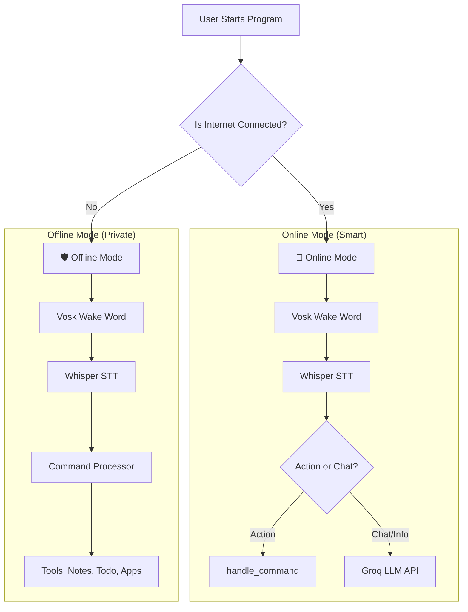

# 🏗️ Project Architecture & Tech Stack Guide

Welcome! This document explains how this Voice Assistant works. It is written for developers of all levels, so even if you are new to coding, you should be able to understand how the pieces fit together.

## 🌟 What is this Project?

This is a **Hybrid Voice Assistant**. "Hybrid" means it has two brains:
1.  **Online Mode**: Highly intelligent, uses the internet to chat naturally and answer questions (powered by **Groq** running LLaMA 3.3).
2.  **Offline Mode**: Works without the internet for basic tasks like opening apps or taking notes.

It automatically checks if you have internet. If yes, it connects to the cloud (Online). If no, it stays on your computer (Offline).

---

## 🗺️ Architecture Diagram

Here is a map of how the system decides what to do:

---

## 📚 Tech Stack (The "Ingredients")

Here are the technologies used in this project and—most importantly—**why** we use them.

### 🌐 Online Mode Technologies

| Technology | What determines it? | Simple Explanation |
| :--- | :--- | :--- |
| **Groq API** | **The Brain** | Groq runs LLaMA 3.3 70B at blazing speed. It understands your questions and generates smart, natural responses in milliseconds. |
| **Vosk + Whisper** | **The Ears** | Same as offline mode — Vosk listens for "Jarvis", then Whisper transcribes your full command. |
| **pyttsx3** | **The Voice** | Speaks the LLM's response out loud using the local text-to-speech engine. |

### 🛡️ Offline Mode Technologies

| Technology | What determines it? | Simple Explanation |
| :--- | :--- | :--- |
| **Vosk** | **The Guard Dog** | Vosk sits quietly and listens ONLY for your "Wake Word" (e.g., "Jarvis"). It doesn't use much battery or power. It "wakes up" the rest of the system when you call it. |
| **Whisper** | **The Scribe** | Once you wake up the assistant, Whisper listens to your command and types it out into text. It's very accurate at hearing words. |
| **pyttsx3** | **The Voice** | This is a simple, robotic voice that lives on your computer. It reads text out loud so the assistant can talk back to you without the internet. |
| **Rapidfuzz** | **The Matchmaker** | If you say "Open Spotify" but type it "Spotofy", Rapidfuzz figures out you meant "Spotify". It matches imperfect spelling to the right commands. |

---

## 📂 Project Structure (Where things live)

Here is a tour of the important files in your folder:

### 1. `main.py` (The Traffic Cop)
This is the starting point. When you run the program, this script checks: "Do we have internet?"
*   **If Yes:** It runs `online_llm_main.py`.
*   **If No:** It runs `offline_assistant_main.py`.

### 2. `online_llm_main.py` (The Online Brain)
This file runs the smart, online voice loop.
*   Uses Vosk/Whisper/pyttsx3 for voice I/O (same as offline).
*   Routes action commands (apps, notes, tasks) through `handle_command()`.
*   Sends general chat/info questions to the **Groq LLM API** for natural responses.

### 3. `offline_assistant_main.py` (The Local Brain)
This is a comprehensive script for working without internet.
*   It has logic for **Wake Word Detection** (waiting for you to speak).
*   It has a **Command Processor** (e.g., `if "time" in command: tell_time()`).
*   It manages local files like `todo_list.json` and `assistant_notes.txt`.

### 4. `tools.py` (The Tool Shed)
This file contains all the "superpowers" your assistant has. Both online and offline modes might use these functions.
*   **Examples:** `get_weather()`, `open_app()`, `send_email()`, `search_web()`.

---

## 🚦 How the Data Flows

### Scenario: You ask "What is the weather?"

#### In Online Mode:
1.  **You speak:** "Jarvis... What's the weather?"
2.  **Vosk:** Hears "Jarvis" and wakes up.
3.  **Whisper:** Records your voice and transcribes "What is the weather".
4.  **Router:** Detects this isn't an action command, sends it to **Groq LLM**.
5.  **Groq:** Returns a natural response, spoken aloud by **pyttsx3**.

#### In Offline Mode:
1.  **You speak:** "Jarvis... What's the weather?"
2.  **Vosk:** Hears "Jarvis" and wakes up.
3.  **Whisper:** Records your voice and types out "What is the weather".
4.  **Command Processor:** Checks its list of distinct commands.
    *   *Note: Offline mode usually can't check real live weather unless it has a specific way to do so, but it tries to match the command.*
5.  **pyttsx3:** Reads out the result using the built-in computer voice.

---

## 🚀 Getting Started for Beginners

If you want to change something:
*   **To change the AI's personality:** Go to `online_llm_main.py` and edit the `SYSTEM_PROMPT` variable.
*   **To add a new offline command:** Go to `offline_assistant_main.py`, find `handle_command`, and add a new `if` statement (e.g., `if "joke" in command: ...`).
*   **To add a new tool:** Write a new function in `tools.py` and make sure to register it in the main files.
